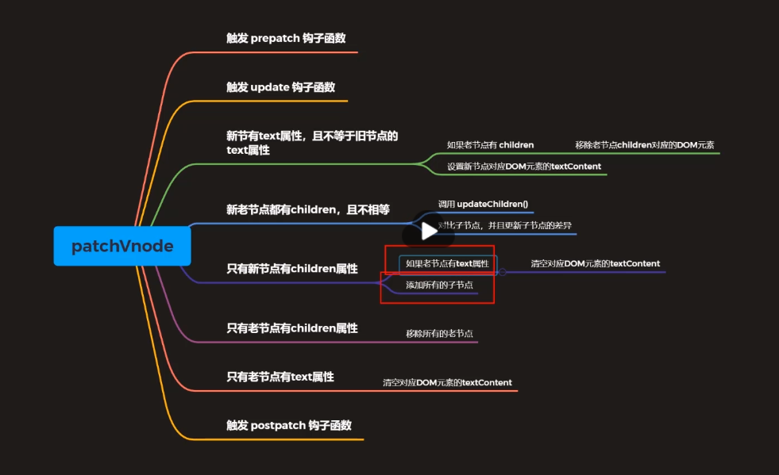

# fed-e-task-01-01

选择题
1、下面关于虚拟 DOM 的说法正确的是：

D. 虚拟 DOM 本质上是 JavaScript 对象，可以跨平台，例如服务器渲染、Weex 开发等。


答： D


2、下面关于 Snabbdom 库的描述错误的是：

D. 使用 patch(oldVnode, null) 可以清空页面元素

答： D

解释：
会发生一个 Cannot read property 'key' of null 错误。

解决方案：
可以创建注释节点来解决这个问题。

```
patch(oldVnode, h('!'))
```

简答题
1、请简述 patchVnode 函数的执行过程。

答：

patchVnode() 函数的执行过程如图所示：

解释：


- 1，触发 prepatch() 钩子函数
- 2，触发 update() 钩子函数
- 3, 判断新节点是否有 text 属性，且不等于旧节点的 text 属性
    - 如果旧节点有 children，则移除旧节点 children 对应的 DOM 元素
    - 设置新节点对应 DOM 元素的 textContent
- 4, 新旧节点都有 children，且不相等
    - 调用 updateChildren() 函数
    - 对比子节点，并且更新子节点的差异
- 5, 只有新节点有 children 属性
    - 如果旧节点有 text 属性, 清空对应 DOM 元素的 textContent
    - 添加所有的子节点
- 6, 只有旧节点有 children 属性，移除所有的旧节点
- 7, 只有旧节点有 text 属性， 清空对应 DOM 元素的 textContent
- 8, 触发 postpatch() 钩子函数

